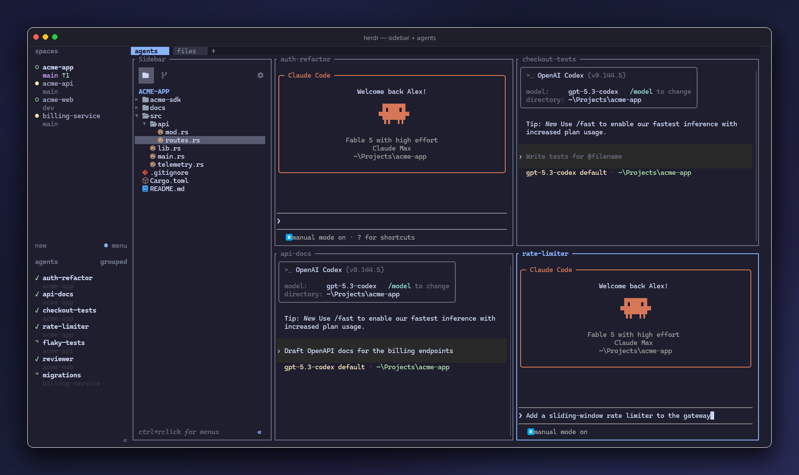

# herdr plugins

Home of **[herdr-aa-sidebar](plugins/herdr-aa-sidebar)** — VS Code's sidebar, rebuilt for the terminal as a [herdr](https://github.com/ogulcancelik/herdr) plugin.

[](plugins/herdr-aa-sidebar)

A file explorer and a full source-control panel (staging, commits, ✧ AI-drafted commit messages, sync, multi-repo, history drawers) in one dockable pane, with an activity bar to flip between them — or split into two panes if that's your style. Mouse-first, keyboard-complete, always docked where you expect it.

**→ [Read the full tour & install instructions](plugins/herdr-aa-sidebar)**

```
herdr plugin install <owner>/<repo>/plugins/herdr-aa-sidebar
```

## Local development

The plugin is a **self-contained Rust crate** (own `Cargo.toml`, own `target/`) so it installs
straight from its subdirectory:

```
cd plugins/herdr-aa-sidebar
cargo build --release
herdr plugin link .
```

`herdr plugin action list` shows the plugin's actions; `herdr plugin log list --plugin <id>`
shows its logs. See `CLAUDE.md` for the full dev workflow, verified herdr behavior notes, and
Windows caveats.
