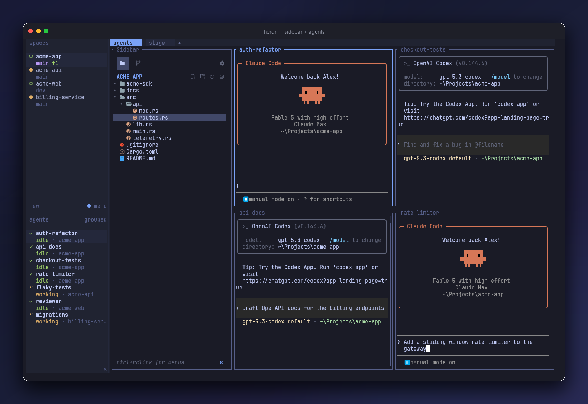
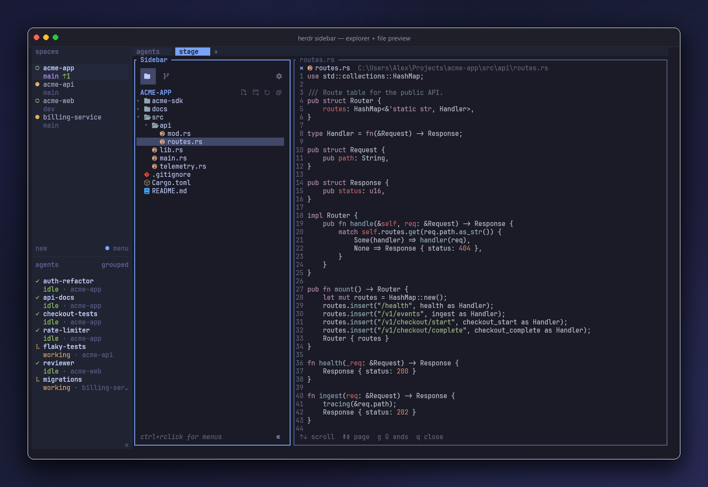
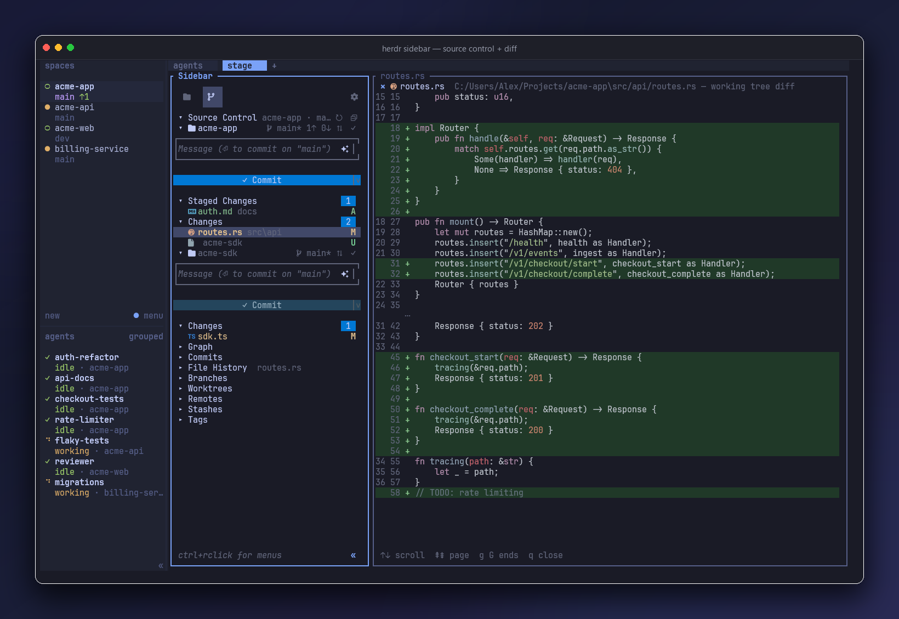
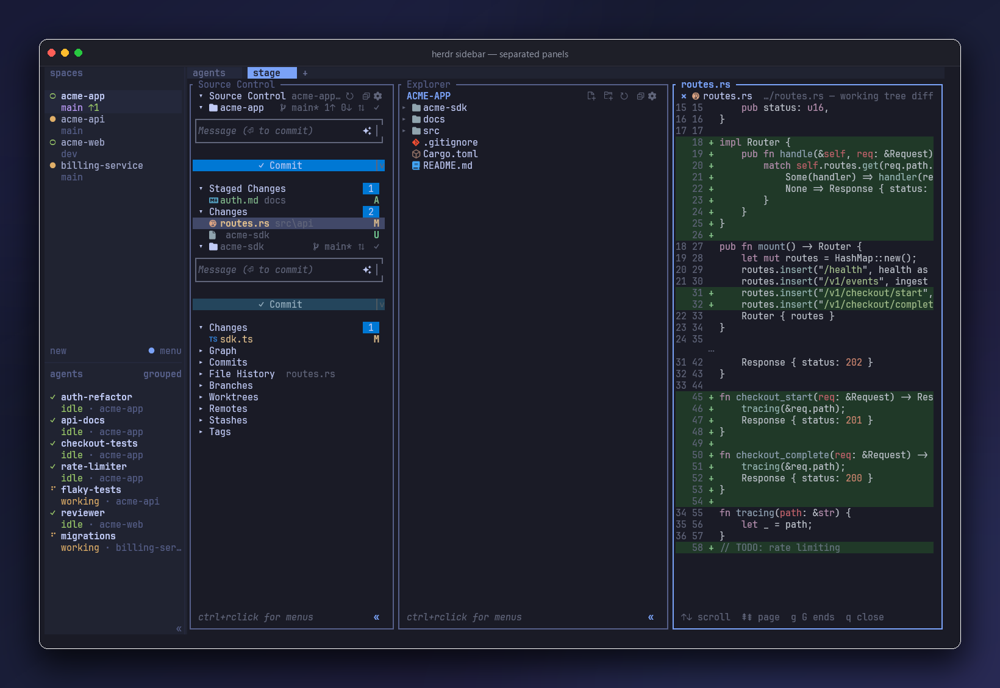

<div align="center">

# Herdr Sidebar

### The sidebar your terminal was missing — inspired by VS Code.

A file explorer and a full source-control panel in one dockable
[herdr](https://github.com/ogulcancelik/herdr) pane — activity-bar switching, mouse
everywhere, AI-drafted commit messages, and a file preview that takes everything beside
the sidebar until Esc puts your panes back.


<br><br>



</div>

That's the sidebar on the left and a 2×2 fleet of Claude Code and Codex agents beside it —
the workflow herdr is built for. If you've ever alt-tabbed out of your terminal just to *look*
at something — the tree, the diff, what's staged — this closes that loop. The sidebar docks
on the left of every herdr tab, restores itself on focus, and is driven entirely by click
or keystroke.

```
herdr plugin install alexarthurs/herdr-sidebar/plugins/herdr-sidebar
```

---

## One pane. Two views. Zero friction.

The activity bar at the top flips between **Explorer** and **Source Control** — *in
process*, so switching is instant: no respawn, no flicker, no lost state on the way. Both
views ship in one small Rust binary.

### 🗂 The Explorer

A real tree, not a directory dump:

<div align="center">

</div>

- Disclosure chevrons, nested indentation, and **two icon themes** — colored Nerd Font
  glyphs (Atom-Material style) or emoji, toggled live. The sidebar auto-picks: material
  when a Nerd Font is installed, emoji otherwise — and on first run without one it
  offers to download and install JetBrainsMono Nerd Font for you (Windows, macOS,
  Linux). If the theme ever guesses wrong (icons showing as ⌷ tofu boxes), press `i`
  once; the choice persists.
- **Click a file and it opens** across everything beside the sidebar — your other panes
  step aside and Esc puts them back exactly where they were, splits and all (prefer a
  50/50 split instead? toggle "Full-size preview" off in ⚙ Settings). Line numbers,
  scrolling, binary-safe). Click another file — the same pane updates in place.
- **Double-click folders** to fold, hover highlights, mouse wheel, and a
  **Ctrl+right-click context menu**: New File, New Folder, Rename, Delete, Copy Path /
  Relative Path, Reveal in File Explorer.
- Dotfiles toggle, live refresh, and a collapse-to-sliver mode when you want the columns back.

### 🔀 Source Control

<div align="center">

</div>

Everything you reach for in an editor's source-control panel, in a terminal pane:

- **Click a change, see the diff** — every changed file opens its colored `git diff` in
  the preview pane (staged vs working tree respected, untracked shown as additions), and
  the diff live-updates while you edit.
- **Stage, unstage, discard, commit** — by key or click, with Staged/Changes sections,
  count badges, and familiar per-file status letters.
- **✧ AI commit messages** — the sparkle button sends the pending diff to your local
  `claude` CLI and drops a drafted subject line into the message box. No claude? A clean
  filename-based fallback kicks in. Never blocks the UI.
- **Sync Changes** — a `⇅ 1↑ 2↓` button appears when you're ahead/behind upstream; one
  press runs `pull --rebase --autostash` + `push` in the background.
- **Multi-repo** — child repositories are auto-discovered, each with its
  own header (branch, dirty `*`, sync/commit icons), message box, and Commit button.
- **History drawers**: GRAPH, COMMITS, FILE HISTORY (follows your selection), BRANCHES,
  REMOTES, STASHES, TAGS.
- **Auto-refreshing** — commits and edits made anywhere show up within seconds.

## Prefer two panels? Take two panels.

<div align="center">

</div>

The ⚙ settings modal — mouse-toggleable like everything else — flips between:

- **Unified sidebar**: both views share one pane, the activity bar switches instantly.
- **Separated panels**: Explorer and Source Control as independent side-by-side panes —
  each keeping the full sidebar width.

<div align="center">

</div>

Icon theme, dotfile visibility, and the full hotkey reference live in the same modal
(with a toggle if you'd rather keep the key hints pinned to the sidebar's footer), and
every choice persists across restarts. However you split it, the dock takes care of itself: a focus hook
re-docks the sidebar in any tab or workspace that's missing one — new project, new
worktree, new window, it's just *there*.

## Install

```
herdr plugin install alexarthurs/herdr-sidebar/plugins/herdr-sidebar
```

or from a local checkout:

```
cd plugins/herdr-sidebar
cargo build --release
herdr plugin link .
```

Open it with an action (or just focus a tab and let the hook dock it):

```
herdr plugin action invoke herdr-sidebar.open-sidebar-windows   # windows
herdr plugin action invoke herdr-sidebar.open-sidebar           # linux / macos
```

**Requirements:** Rust to build, herdr ≥ 0.7. **Recommended:** a Nerd Font terminal face
for the material icons — without one the sidebar auto-starts in its emoji theme, which
renders in any font. Note Windows Terminal's bundled Cascadia does NOT include the icon
glyphs; grab a patched font in one command and select it in your terminal profile:

```
winget install DEVCOM.JetBrainsMonoNerdFont
```

(or any font from [nerdfonts.com](https://www.nerdfonts.com/font-downloads), e.g.
CaskaydiaCove). Also recommended: the
[`claude` CLI](https://claude.com/claude-code) for ✧ commit messages.

## Keys

| Explorer | | Source Control | |
|---|---|---|---|
| `↑↓` / `jk` | move | `⏎` | stage / unstage |
| `←→` / `hl` | fold / unfold | `a` / `u` | stage all / none |
| `⏎` | toggle folder · preview file | `c` | focus message box |
| `r` | refresh | `A` | ✧ suggest message |
| `.` | dotfiles | `S` | sync ↑↓ |
| `b` | collapse to sliver | `r` | refresh |
| `s` | settings | `s` | settings |
| `1` / `2` | switch view | `1` / `2` | switch view |

…and the mouse for all of it: click, double-click, scroll, hover, Ctrl+right-click menus.

## Actions

| Action | What it does |
|---|---|
| `open-sidebar` / `open-sidebar-windows` | Toggle the sidebar: open left-docked / focus / close |
| `open-git` / `open-git-windows` | Toggle a separate Source Control pane (separated mode) |
| `redeploy` / `redeploy-windows` | After a rebuild: refresh every workspace onto the new build |

## Under the hood

- **One self-contained Rust crate** — ratatui + crossterm + serde, nothing else. Both
  views compile into one binary; separated panes are the same binary pinned with `--view`.
- All herdr control (docking, labels, identity tokens, pane spawning) goes over **herdr's
  socket API directly**; the Windows focus hooks run a windowless GUI-subsystem sidecar so
  nothing ever flashes a console window.
- The left dock survives real layouts — split-the-leftmost + swap, full-height repair,
  ratio-aware resizing — all unit-tested against herdr's actual JSON.
- Windows quirks (exe locking, PowerShell 5.1 BOMs, double-width Nerd Font glyphs) are
  handled, and the hard-won findings are documented in [`CLAUDE.md`](CLAUDE.md).

---

<div align="center">
<sub>Screenshots: herdr on Windows Terminal, CaskaydiaCove Nerd Font.</sub>
</div>
