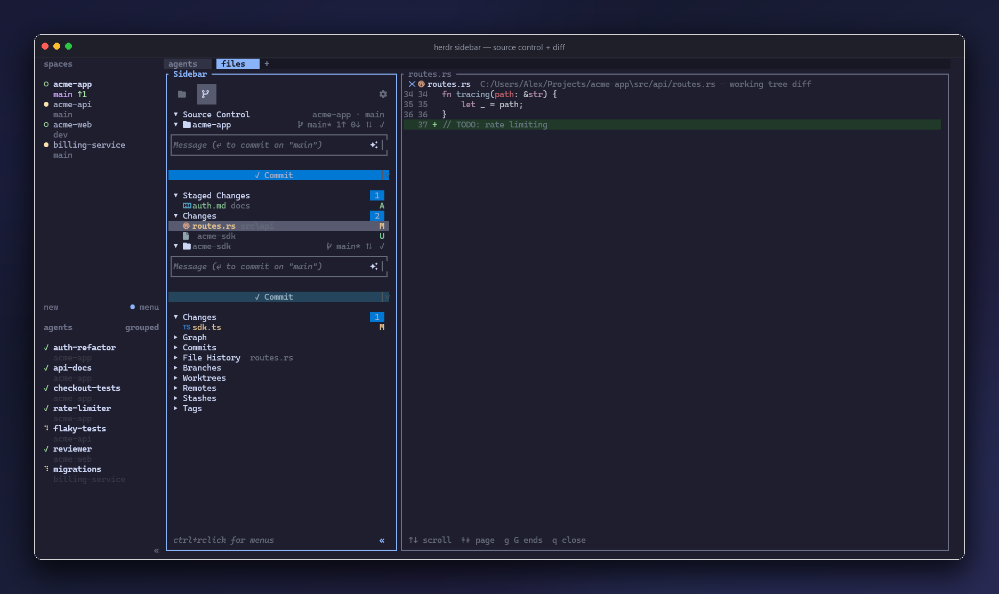
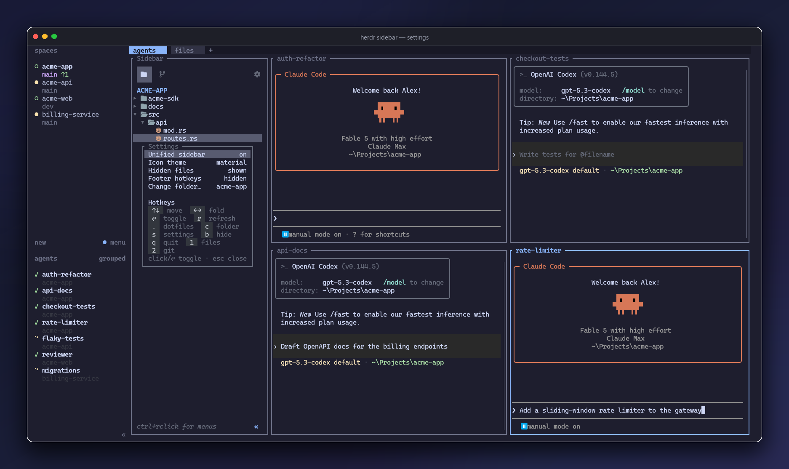

# herdr-aa-sidebar

**VS Code's sidebar, living in your terminal.**

A file explorer and a full source-control panel in one [herdr](https://github.com/ogulcancelik/herdr) pane — with an activity bar to flip between them, mouse support everywhere, AI-drafted commit messages, and a file preview that opens right beside the tree. If you've ever alt-tabbed to VS Code just to *look* at something, this is for you.


## Why you want this

Terminal multiplexer workflows are fast until you need to *see* your project: what changed, what's staged, where that file lives. Then you're typing `git status`, `ls`, `cat` — or reaching for an editor. **herdr-aa-sidebar puts the two panels you actually reach for into a dock that's always there**, in every workspace, restored on every focus, and driven entirely by click or keystroke:

- **One pane, two views.** The activity bar switches between Explorer and Source Control *in-process* — instant, no flicker, no respawn. Prefer them side by side? One settings toggle splits them into separate panes. Your choice is remembered.
- **It behaves like VS Code**, not like a demo. Disclosure chevrons, file-type icons (Nerd Font *and* emoji themes), hover highlights, single-click preview, double-click folders, Ctrl+right-click context menus, count badges, status letters in VS Code's git colors, keycap-styled hotkey hints.
- **It's always fresh.** A focus hook re-docks the sidebar in any tab or workspace that's missing one — new project, new worktree, new window: the sidebar is just *there*.

## The Explorer

A real tree, not a directory dump:

- Expand/collapse with chevrons, arrow keys, or **double-click** — plus a dotfiles toggle and live refresh.
- **Click a file and it opens** in a preview pane beside the sidebar (line numbers, scroll, binary-safe). Click another file — the same pane updates in place. `q` closes it.
- **Ctrl+right-click** any row for New File, New Folder, Rename, Delete, Copy Path / Relative Path, and Reveal in File Explorer.
- Two icon themes: **material** (Atom-Material-style Nerd Font glyphs, colored per file type) and **emoji** — toggle live with one key.
- Collapse the whole pane to a slim sliver when you want the space back; one click brings it home.

## The Source Control panel



Everything VS Code's SCM view does, in a terminal pane:

- **Stage, unstage, discard, commit** — by key or by click, with Staged/Changes sections, count badges, and per-file status letters in the colors you know.
- **✧ AI commit messages.** Hit the sparkle (or `A`) and the pending diff goes to the local `claude` CLI; a drafted subject line lands in the message box, ready to edit or commit. No claude installed? A clean filename-based fallback kicks in. Never blocks the UI.
- **Sync Changes** — a `⇅ 1↑ 2↓` button appears the moment you're ahead or behind upstream; one press runs `pull --rebase --autostash` + `push` in the background.
- **Multi-repo, the VS Code way.** Child repositories are auto-discovered; each gets its own header (branch, dirty `*`, sync/commit icons), its own message box, and its own Commit button, inline in one scrolling view.
- **Git-Graph-style drawers**: GRAPH, COMMITS, FILE HISTORY (follows your selection), BRANCHES, REMOTES, STASHES, TAGS.
- **Auto-refreshing** — edits and commits made anywhere show up within seconds. No manual refresh, no watchers to configure.

## One sidebar or two panels — your call



The ⚙ settings modal (mouse-toggleable, like everything else) flips between:

- **Unified sidebar** — both views share one pane, the activity bar switches instantly.
- **Separated panels** — Explorer and Source Control as independent panes, side by side.

Icon theme and dotfile visibility live in the same modal. All of it persists across restarts.

## Install

```
herdr plugin install <owner>/<repo>/plugins/herdr-aa-sidebar
```

or from a local checkout:

```
cd plugins/herdr-aa-sidebar
cargo build --release
herdr plugin link .
```

Then open it with the manifest action (or just focus a tab — the hook docks it for you):

```
herdr plugin action invoke herdr-aa-sidebar.open-sidebar-windows   # windows
herdr plugin action invoke herdr-aa-sidebar.open-sidebar           # linux/macos
```

**Requirements:** Rust (to build), herdr ≥ 0.7. **Recommended:** a Nerd Font terminal face for the material icons (emoji theme works everywhere), and the [`claude` CLI](https://claude.com/claude-code) for ✧ commit messages.

## Keys

| Explorer | | Source Control | |
|---|---|---|---|
| `↑↓` / `jk` | move | `⏎` | stage / unstage |
| `←→` / `hl` | fold / unfold | `a` / `u` | stage all / none |
| `⏎` | toggle folder / preview file | `c` | focus message box |
| `r` | refresh | `A` | ✧ suggest message |
| `.` | dotfiles | `S` | sync ↑↓ |
| `b` | collapse to sliver | `r` | refresh |
| `s` | settings | `s` | settings |
| `1` / `2` | switch view (unified) | `1` / `2` | switch view (unified) |

Plus the mouse for all of it: click, double-click, scroll, hover, Ctrl+right-click menus.

## Actions

| Action | What it does |
|---|---|
| `open-sidebar` / `open-sidebar-windows` | Toggle the sidebar: open left-docked / focus / close |
| `open-git` / `open-git-windows` | Toggle a separate Source Control pane (separated mode) |
| `redeploy` / `redeploy-windows` | After a rebuild: refresh every workspace onto the new build |

## Engineering notes

For the curious (and the contributors):

- The whole plugin is **one self-contained Rust crate** — ratatui + crossterm + serde, nothing else. Both views compile into one binary; separated panes are the same binary pinned with `--view`.
- All herdr control (docking, labels, identity tokens, pane spawning) goes over **herdr's socket API directly** — the Windows focus hooks run a windowless GUI-subsystem sidecar so nothing ever flashes a console window.
- The left dock survives real layouts: split-the-leftmost + swap, full-height repair, ratio-aware resize — all unit-tested against herdr's actual JSON.
- Windows quirks (exe locking, PowerShell 5.1 BOMs, double-width Nerd Font glyphs) are handled and documented in the repo's `CLAUDE.md`.
